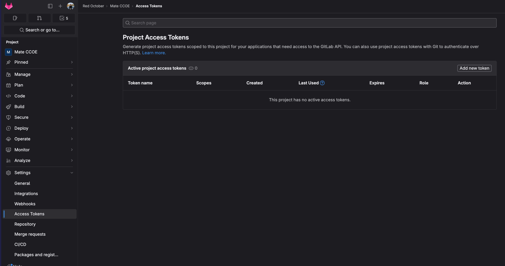
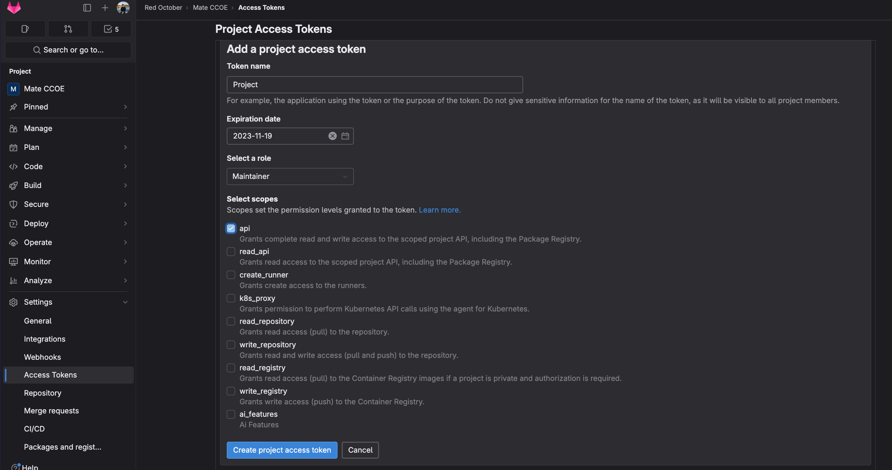
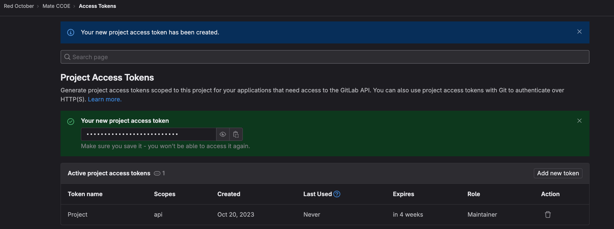
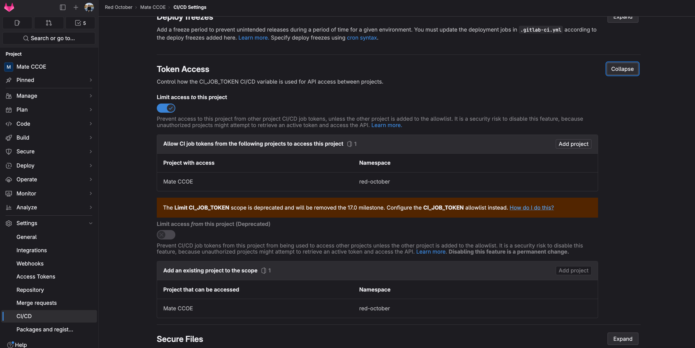
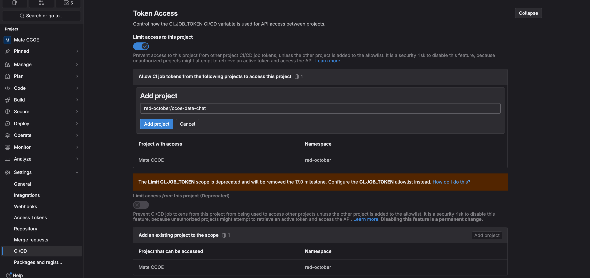
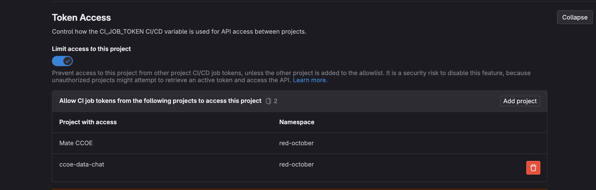

# <span style="color: #e20074">Mate as a Service by CCOE DTIT (formerly T-Chat)</span>

# **What is Mate?**

- using telekom/private data with Azure OpenAI services and Azure AI (formerly Cognitive) Search (RAG-approach) as a service
- initially forked from [Microsoft Azure Sample Repository](https://github.com/Azure-Samples/azure-search-openai-demo/tree/main)
- It is PSA-compliant (without the data, that every user needs to get approved separatly)
- When you are going to use this software for production, please reach out for the group workers council (KBR). For preparation reach out first for Jerome Chvaillier (Jerome.Chevaillier@telekom.de)

# **Roadmap**
- [x] Runner costsaving waiting on running jobs, multiple mate per group support (April 2024)
- [x] Direct File Blob Data Integration (Feburary 2024)
- [x] Standardised OpenID Connect Auth (February 2024)
- [x] Langchain Data Integration (January 2024)
- [x] Feedback and Application Insights (November 2023)
- [x] Language Support (October 2023)
- [x] Initial Release (October 2023)

| Contents                                                                       |
| ------------------------------------------------------------------------------ |
| **1** How to deploy                                                            |
| - **1.1** Information & What needs to be done **before** deployment            |
| - **1.1.1** Known Issues during and when deploying                             |
| - **1.2** What needs to be done **after** deployment                           |
| - **1.3** Environment CI/CD Variables                                          |
| - **1.4** File CI/CD Variables                                                 |
| -- **1.4.1** ENVIRONMENT                                                       |
| -- **1.4.2** CONTEXT                                                           |
| -- **1.4.3** ABBREV                                                            |
| **2** Data Integration                                                         |
| - **2.1** Data Integration Variables                                           |
| - **2.2** File Integration (PDFs and convertible files)                        |
| - **2.3** Langchain Integration (MyWiki/Confluence, Websites/Urls, Docusaurus) |
| -- **2.2.1** Environment CI/CD Variables                                       |
| -- **2.2.2** File CI/CD Variables                                              |

---

---

---

### 1 How to deploy: **Fork repository and adjust CI/CD Settings**

#### 1.1 Information & What needs to be done **before** deployment

- **The resource group has to be created upfront and be named "rg-<AZURE_ENV_NAME>"**

  - if the AZURE_ENV_NAME = mate, the resource group must be named = rg-mate
  - if it is not done like this, there will be issues with providing rbac rights during the deployment
    ***

- currently only Enterprise Subscriptions are supported (dtit_cid0000, dtit_cip0000)
- Service Principal for deployment needs _Contributor_ rights (the respective SP_dtit_cix0000 Service Principal is fine for usage)
- A private gitlab runner is required -> a package that automatically installs one is available [in this repository](https://gitlab.devops.telekom.de/red-october/public/azure-gitlab-runner-private)
  - the private runner should be created on group level, if there are multiple instances of Mate in a subscription, the ACCESS_TOKEN must also be on group level, then a clean lifecycle of the private runner is ensured.
  - for this you should already create two subnets in your existing virtual network (must be vnet_dtit_cix0000 of your subscription)
  - one with /27 prefix (e.g. sn-mate) and onefor the web app service with at least /28 prefix (e.g. sn-mate-appservice)
  - the further configuration of those subnets will be done by the pipeline of the backend automatically

#### 1.1.1 Known Issues

- When the model is not working after deployment, try accessing model_url/docs, if nothing is shown, try restarting or bumping the app service tier
- When the frontend is returning unexspected error, go to the network tab and check the real error
- When the search is returning an error, set one setting in the semantic ranker, this is a bug in microsofts deployment

#### 1.2 What needs to be done **after** deployment

- You need to submit a request to add your search service to our central dns, as it is privately connected. This can be done via [ticket](https://jira.telekom.de/servicedesk/customer/portal/301/group/906). Please name the subscription, name of search service, the internal ip (found in the private endpoint of the search service under dns configuration).

#### 1.3 Environment CI/CD Variables

- all these variables have to be injected into the CI/CD Settings as a seperate variable

| Variable            | Description                                                                                              |
| ------------------- | -------------------------------------------------------------------------------------------------------- |
| OpenAILocation      | _francecentral_, _swedencentral_ or _westeurope_ are supported                                           |
| REPO_URL            | gitlab repository url for the data (https://gitlab.devops.telekom.de/red-october/ccoe-data)              |
| AZURE_CLIENT_ID     | service principal id (sp for deployment)                                                                 |
| AZURE_CLIENT_SECRET | secret for the service principal                                                                         |
| AZURE_TENANT_ID     | tenant id (628242bd-7e70-4aa9-8ee1-72586b4540fe for our use cases)                                       |
| ACCESS_TOKEN        | for api access, can be created under settings/accesstoken -> api, maintainer and up to 3 months validity |
| RUNNER_NAME         | The name of the provisioned private gitlab runner in the same subscription                               |
| RUNNER_RG           | The resource group name of the provisioned private gitlab runner in the same subscription                |
| RUNNER_TAG          | The tag of the provisioned private gitlab runner in the same subscription                                |
| SUBSCRIPTION_ID     | The id of the subscription                                                                               |

---

#### 1.4 File CI/CD Variables

##### 1.4.1 **ENVIRONMENT**

(Name of Variable: _Environment_, then paste the mandatory example below table and fill out/adjust)

**mandatory** (Example):

```
AZURE_AUTH_ClIENT="xxxxxxxxxx-xxxx-xxxx-xxxx-xxxxxxxxxx"
AZURE_ENV_NAME="azure-search-openai-dev-env-name"
AZURE_SUBSCRIPTION_ID="xxxxxxxxxx-xxxx-xxxx-xxxx-xxxxxxxxxx"
AZURE_TENANT_ID="628242bd-7e70-4aa9-8ee1-72586b4540fe"
AZURE_LOCATION="westeurope"
AZURE_VNET_RESOURCE_GROUP="rg-ci-vnet"
AZURE_VNET_NAME="vnet_dtit_cix00xx"
AZURE_SUBNET_NAME="sn-standard"
AZURE_SUBNET_NAME_APPSERVICE="sn-appservice"
AZURE_ALLOWED_CORS="https://your.ui.url,https://yourother.ui.url"
```

additional, non-mandatory variables that are optional (Example):

```
AZURE_OPENAI_CHATGPT_MODEL_NAME="gpt-35-turbo"
AZURE_OPENAI_CHATGPT_MODEL_VERSION="0613"
AZURE_AUTH_ROLE="Model.User"
AZURE_AUTH_TENANT="bde4dffc-4b60-4cf6-8b04-a5eeb25f5c4f"
AZURE_APPSERVICE_SKU="B1"
AZURE_SEARCH_SERVICE_SKU="standard"
```

| Variable                           | Description                                                        |
| ---------------------------------- | ------------------------------------------------------------------ |
| AZURE_AUTH_CLIENT \*               | Client ID of app registration used for auth                        |
| AZURE_ENV_NAME \*                  | name of the environment                                            |
| AZURE_SUBSCRIPTION_ID \*           | id of subscription                                                 |
| AZURE_TENANT_ID \*                 | id of the tenant                                                   |
| AZURE_LOCATION \*                  | location should be westeurope                                      |
| AZURE_VNET_RESOURCE_GROUP \*       | Name of the existing VNET resource group                           |
| AZURE_VNET_NAME \*                 | Name of the existing VNET                                          |
| AZURE_SUBNET_NAME \*               | Name of the existing Subnet inside the existing VNET               |
| AZURE_SUBNET_NAME_APPSERVICE \*    | Name of the existing Subnet inside the existing VNET               |
| AZURE_ALLOWED_CORS \*              | List of allowed URLs for cors                                      |
| AZURE_AUTH_ROLE                    | Name of the Role (not set = no authorisation, just authentication) |
| AZURE_AUTH_TENANT                  | REQUIRED only if Role is set AND UI Tenant != Backend Tenant       |
| AZURE_REDEPLOY_OPENAI              | (re)deploys OpenAI Instance (for fixing current bug)               |
| AZURE_OPENAI_CHATGPT_MODEL_NAME    | model name (gpt-35-turbo, gpt-35-turbo-16k, gpt-4, gpt-4-32k)      |
| AZURE_OPENAI_CHATGPT_MODEL_VERSION | model version (0613, 0914)                                         |
| AZURE_SEARCH_SERVICE_SKU           | standard (basic,standard,standard2,standard3)                      |
| AZURE_APPSERVICE_SKU               | B1 (B1,B2,B3,S1,S2,S3,P1,P2,P3,P4)                                 |

\* = **mandatory**

**Important**: This is a minimal setup, more variables can be put into this file to use more existing services

---

##### 1.4.2 **CONTEXT**

(Name of Variable: _CONTEXT_, please take example and adjust only the upper three points (not the sourcing))

Context for the model to have an adjusted frame for the questions and answers. Python File
system_message_chat_conversation -> system message for the model
query_prompt_template -> query prompt for using question to retrieve information

```python

system_message_chat_conversation = """You are an AI built by Deutsche Telekom. You have to answer the question abiding by the following rules:
- You will refer to yourself as the CCoE Assistant. You do not have a name.
- You are brief and precise in your response.
- Take only the information provided in the prompt into account for your answer.
- Each source has a name followed by a colon. You have always to include the source name in front of the colon for each fact you use in the response. Use square brackts to reference the source and list each source separately e.g. [info1.pdf][info2.pdf].
- In case of ambiguity questions by the human ask clarifying questions.
- Translate your answer into {promptlang}
- If there are nothing provided in the prompt say {noidea}.
{injected_prompt}
"""

query_prompt_template = """Below is a history of the conversation so far, and a new question asked by the user that needs to be answered by searching in a knowledge base about questions.
    Generate a search query based on the conversation and the new question.
    Do not include cited source filenames or numbers in brackets e.g. [1] or [3] and document names e.g info.txt or doc.pdf in the search query terms.
    If the question is not in English, translate the question to English before generating the search query.
    If the question is not in {language}, translate the question to {language} before generating the search query.
"""


```

---

##### 1.4.3 **ABBREV** (Name of Variable: _ABBREV_, please put in at least one)

Abbreviations in csv format, will be transformed for better performance during each deployment
can be used to overwrite Abbrevations with Telekom Abbreviations

```csv
CMS, Content Management System
LLM, Large Language Model
```

---

Add an ACCESS_TOKEN to your project to enable automatic infrastructure update.
!IMPORTANT! If you have or are planning more than one instance per subscription (using only one runner), the ACCESS_TOKEN needs to be on group level and the instances need to be in the same group in Gitlab.
This is not required, but strongly recommended as it fully autmates the deployment (otherwise you have to copy paste the artifact to the Environment Variables)

- **Step 1**: go to settings in your gitlab project, then go on Access Tokens
  
- **Step 2**: create a new Access Token that has api-Access and maintainer rights
  
- **Step 3**: create the token and copy it out (needs to be added as a ci/cd variable named "ACCESS_TOKEN")
  

### 2 Data Integration

What is supported?

- PDFs (or files that can be converted to pdfs)

- Langchain Integration (Confluence/MyWiki, Docusaurus, URLs/Websites, can be extended with other document loaders)

Why only those?

- We value interpretabilty and therefore we always want to integrate a way for the end user to access sources.
- The integration of sources that are not accessable or at least showable (like databases etc.) are currently not planned.

Please be aware: The integration must be done by someone that is proficient with gitlab and fully understands its functionality

#### 2.1 Data Integration Variables

In general, there are CI/CD variables, that enable different settings for the data loading process

Because of backwards compatability, all of those values are not mandatory, but can be set. You can see each default value here and also other possible values

**DATA_MODE** -> Mode of Data integration
default value: _file_
possible values: _lc_ or _all_

_file_ will only import files

_lc_ will only import what is specified in the langchain config and mode(see 2.3)

_all_ will import both/all

**DATA_CONVERT**
default value: _false_
possible value: _true_

if set true, data from the data2convert folder (see 2.2) will be converted and put into the data folder during data integration

#### 2.2 File Integration (PDFs and convertible files)

 -> FILE_MODE Variable, will allow to not use git, but also Azure Storage Blobs directly for data integration

 - FILE_MODE -> git or blob (default: git)

BLOB

In order to connect your data from another folder in your storage account, you will need a policy exemption on your storage account. You can create a [ticket](https://jira.telekom.de/servicedesk/customer/portal/301/group/906) for that. The exemption will allow you to put your IP Address into the storage account networking, to be able to connect and upload data in the private setup.

Required steps:

- Exemption
- IP Address under Networking
- create container "data"
- upload your files

Rules: folders in the container max one level. mydata/file.pdf -> fine, mydata/mydata/file.pdf -> not fine.
Rules: folder are not allowed to have underscore "_" in name


GIT 

In order to connect your file data (pdfs, mds etc.) to your backend, a second repository is required, that needs to have all pdf files in a folder named **data** 

To enable a permanent connection between those repositories, a connection needs to be established. The Data repository must allow the project repository to access its data with the CI_JOB_TOKEN -> This is done like this:

- Step 1: Go to Settings and CI/CD -> Token Access
  

- Step 2: Put in your data (group or personal name / project name)
  

- Step 3: Check if it has been added
  

#### 2.3 Langchain Integration (MyWiki/Confluence, Websites/Urls, Docusaurus)

##### 2.3.1 Gitlab CI/CD Variables

Gitlab Enviroment variable **LC_MODE** can be either:

- create
- delete

-> create will create and update the index if called (will also clean up, if content is less then before)
-> delete with delete the indexed sections for the documents

everything that is in the config when executed will be created or deleted, depending on the setting

##### 2.3.2 File CI/CD Variables

Gitlab CI/CD File variable **LANGCHAIN_CONFIG** example

```json
[
  {
    "loader": "confluence",
    "category": "wiki",
    "splitter": "standard",
    "config": {
      "url": "url of confluence, (e.g wiki.telekom.de)",
      "username": "email of user",
      "token_ref": "name of variable where api_key of user is put",
      "space_key": "space from wiki/confluence",
      "include_att": false,
      "limit": 10,
      "max_pages": 10
    }
  },
  {
    "loader": "rurl",
    "splitter": "standard",
    "config": {
      "url": "url of website",
      "max_depth": 3
    }
  },
  {
    "loader": "docusaurus",
    "splitter": "standard",
    "config": {
      "url": "url of website built on docusaurus"
    }
  }
]
```

## Langchain Document loaders - Parameters

**mandatory**

- loader -> type of document loader
  currently supported: _confluence_ (mywiki/wiki), _docusaurus_ (documentation), _rurl_ (website with link depth)

- config -> config for the specific loader

**config for confluence**

- url -> string, base url of confluence
- username -> string, email of user
- token_ref -> string, variable in gitlab, where token for the loader is located (!! no token inside langchain config !!)
- space_key -> string, name of the confluence/wiki space that is aimed to be indexed
- include_att -> boolean, if attachments are also included (can cause issues, if datatype is not common/integrated)
- limit -> number, max number of pages in general that is processed
- max_pages, number, max number of pages per space that is processed

**config for rurl**

- url -> string, base url of website
- max_depth -> max depth of links (recursive integration of website)

**config for docusaurus**

- url -> string, base url of website, where docusaurus documentation is hosted

**not mandatory**

- splitter -> type of splitter for splitting content/documents to sections for search
  currently supported: _standard_ (splitting like Microsoft, default value), _recursive_ (langchain splitting)

- category -> category for document search
  currently supported -> string for category, can be selected
  if no category is wanted, delete the parameter from the object in the list

## How to use the pipeline:

- A private gitlab runner is required -> a package that automatically installs one is available [in this repository](https://gitlab.devops.telekom.de/red-october/public/azure-gitlab-runner-private), you can shut it down. The pipeline will automatically start and stop the runner if everything runs fine. Please also have a look at automatic shutdown times, to prevent too much costs in case the pipeline fails.

- When you start a pipeline, nothing will be provisioned automatically

**PLEASE DO NOT START ALL JOBS OF THE auto_start STAGE PARALELLY, only the respective job that is required (can also be done after each other)**

- If nothing is provisioned yet, you have to either execute the **all_start job** (provision + deploy) or the **provision_start** job

- If you want to update your infrastructure only, **provision_start**, if you want to update your application only, **deploy_start**

- We know this is not optimal, but Azure and Gitlab are not as compatible as it could be. This will be made cleaner in the future.

## Current Structure of the application code

- _/app/backend_ contains the python backend app
  - _/approaches_ contains the approaches (currently only one, but is extendable)
    - chatreadretrieveread.py contains the backend process for the /chat api
    - core/\*.py contains functions that are used in the approaches (for logging, handling sources in responses etc.)
  - app.py contains the flask (async version = quart) code that exposes the /chat and /content/{path} api for potential frontends
  - context.py (is cicd variable) contains the context of the backend, that is given to chatgpt, how to act etc.
  - abbrev.py (is cicd variable) contains generated abbreviations that LLMs cannot know
  - requirements.txt contains the python packages for the backend

### How to run and use locally?

- this works in bash shell, required are Python 3.10 or higher, azd and az cli (only tested on mac os)

### login

```bash
# login with azd and az cli's (pipeline client and local client need to be similar)
az login --service-principal -u AZURE_CLIENT_ID -p AZURE_CLIENT_SECRET --tenant AZURE_TENANT_ID
azd auth login --client-id AZURE_CLIENT_ID --client-secret AZURE_CLIENT_SECRET --tenant-id AZURE_TENANT_ID
```

### create required directories files that are in .gitignore

- .azure/
- .azure/config.json ->

```json
{
  "version": 1,
  "defaultEnvironment": "<AZURE_ENV_NAME>"
}
```

- .azure/<AZURE_ENV_NAME>/
- .azure/<AZURE_ENV_NAME>/.env -> include ENVIRONMENT
- .azure/<AZURE_ENV_NAME>/config.json ->

```json
{
  "infra": {
    "parameters": {
      "openAiResourceGroupLocation": "<OpenAILocation>"
    }
  }
}
```

- app/backend/core/context.py -> put in CONTEXT

- data -> include pdfs
- data2convert -> include .md, .png and more (coming soon)

### deploy/update everything

```bash
# bundles backend, deploys infrastructure and
# deploys backend to app service
azd up
```

### deploy infrastructure

```bash
# deploys backend to app service
azd provision
```

### deploy application code

```bash
# deploys backend to app service
azd deploy
```

start python server locally (for development)
**Important**: Only works on macos out of the box, in app.py the cors needs to be active, you have to adjust the platform for your environment

```bash
# navigate to the repository folder
cd app
./start.sh
```

update data locally (will update real search service)

- this will synchronise the local/repository data with a storage account and act depending on if it is new (will be uploaded and processed), only in the storage account (will be deleted from storage and search), or changed (will be updated in storage and search)
- the comparison is done via using md5 hashes, which is a mitigated security issue in gitlab, as we do not use it for encryption, but comparison.

```bash
# navigate to the repository folder
scripts/prepdocs.sh
```

### testing the api without UI (localhost:5000/chat or 127.0.0.1:5000/chat)

##### using with localhost based UI

- [Clone or Download UI Repository](https://gitlab.devops.telekom.de/red-october/telit-azure-openai-gpt-frontend)
