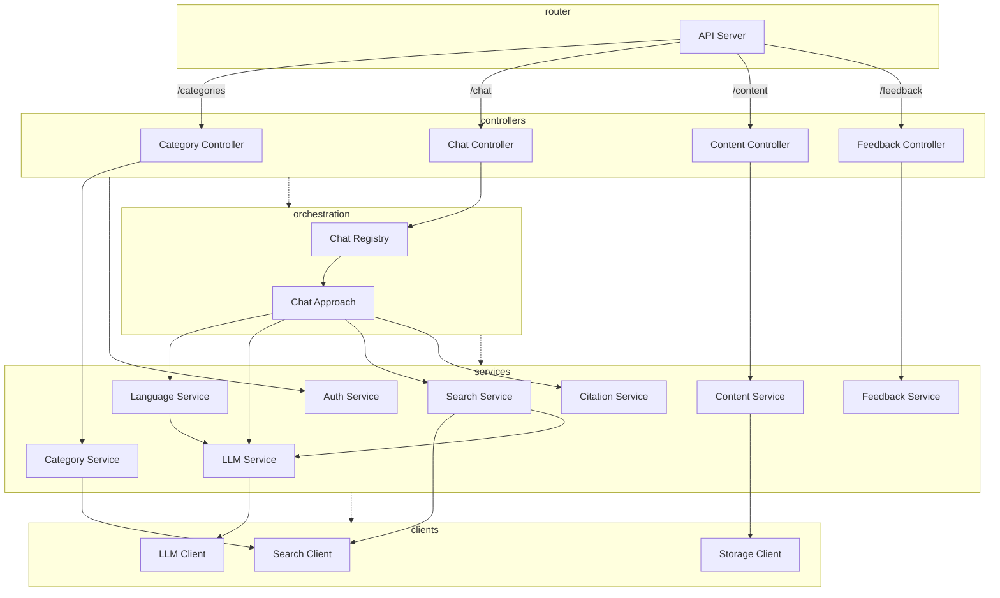

# Mate Architecture Documentation<!-- omit in toc -->

The backend of the Mate application is built using a service-oriented architecture (SOA) with the dependency injection pattern. This architecture enhances maintainability, testability, and scalability. The backend is organized into several layers and services, each with specific responsibilities.

- [Architecture Diagram](#architecture-diagram)
- [Layers](#layers)
  - [Controller Layer](#controller-layer)
  - [Orchestration Layer](#orchestration-layer)
  - [Service Layer](#service-layer)
  - [Data Access Layer](#data-access-layer)
- [Services](#services)
  - [Auth Service](#auth-service)
  - [Category Service](#category-service)
  - [Citation Service](#citation-service)
  - [Content Service](#content-service)
  - [Feedback Service](#feedback-service)
  - [Language Service](#language-service)
  - [LLM Service](#llm-service)
  - [Search Service](#search-service)

## Architecture Diagram

## Layers

The layers are responsible for different aspects of the application. They are organized in a way that allows for easy maintenance and extension. The layers are as follows (from top to bottom):

### Controller Layer

Handles incoming HTTP requests, routes them to the appropriate layer, validates requests, and formats responses. The controllers are thin, delegating most work to the next layer.

### Orchestration Layer

Manages communication between controllers and services for complex requests involving multiple services. It also handles transaction management and error handling.

This layer may only be necessary for complex requests that require coordination between multiple services.

### Service Layer

Contains the business logic of the application. Each service is responsible for a specific domain or functionality. Services are loosely coupled and can be easily replaced or extended. They interact with the data access layer to retrieve data if needed.

### Data Access Layer

Contains clients for external services like Azure Search, Azure Blob Storage, OpenAI API, etc. The clients handle communication with these external services.

## Services

### Auth Service

Handles MSAL/OIDC authentication and authorization of users.

### Category Service

Responsible for getting category facets using the Azure Search client.

### Citation Service

Extracts citations from the LLM answers.

### Content Service

Returns the file for a given path using the Azure Blob Storage client.

### Feedback Service

Handles the feedback submission.

### Language Service

Handles language detection, translation, abbreviation replacement, and more.

### LLM Service

Generates LLM answers using the OpenAI API, extracts LLM answers, and generates embedding vectors.

### Search Service

Handles search functionality, including search query generation, search execution, and search result processing.
